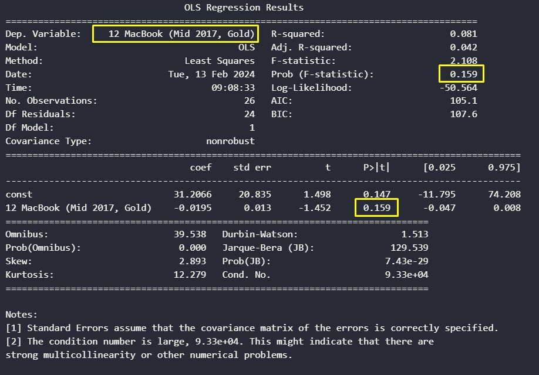

# Elasticidade de Preço com Regressão

Experimento sobre a Elasticidade de Preço

## 1.	Problema de negócio
Entender e analisar a interação entre oferta e demanda em um mercado. A oferta e a demanda são cruciais para o funcionamento da economia, pois influenciam o comportamento do mercado. Em particular, a demanda por um produto ou serviço tende a diminuir à medida que o preço aumenta e aumentar à medida que o preço diminui, seguindo a chamada lei da demanda, que descreve essa relação inversa entre preço e demanda. Portanto, o desafio é compreender como as mudanças nos preços afetam a demanda pelos produtos ou serviços em um mercado específico, e como isso impacta as estratégias de produção, precificação e posicionamento no mercado.

## 2.	Objetivo
O objetivo relacionado ao problema de negócio descrito é compreender a sensibilidade da demanda por um produto ou serviço às mudanças de preço, através da análise de elasticidade-preço da demanda. Isso inclui calcular a elasticidade-preço para determinar se a demanda é elástica ou inelástica, e utilizar esses insights para determinar o preço ideal que maximiza as receitas ou lucros.

## 3.	Premissas do negócio
A lei da demanda postula que, em geral, a demanda por um produto diminui à medida que seu preço aumenta e aumenta quando o preço diminui. Essa relação é representada por uma curva ou função de demanda, levando em conta diversos fatores como preço, renda dos consumidores, preços de produtos substitutos e complementares. No entanto, neste estudo, focamos exclusivamente na análise da demanda em relação ao preço, sem considerar variáveis como renda dos consumidores, preços de bens substitutos, bens complementares e preferências dos consumidores.

## 4.	Estratégia adotada para solução

Passo 1 - Descrição dos dados: O objetivo deste passo é ter um entendimento inicial de como os dados estão relacionados com o problema de negócio proposto, para tal, lançando mão de algumas métricas estatísticas de posição e distribuição.

Passo 2 - Análise exploratória: A análise exploratória dos dados (EDA) tem como principal objetivo proporcionar uma compreensão mais aprofundada dos dados, tais como: Compreender a distribuição das variáveis numéricas e categóricas, identificar outliers (valores atípicos), se existe desbalanceamento da variável resposta, correlações entre as variáveis entre outras análises.

Passo 3 - Filtragem das variáveis: No processo de filtragem, busca-se selecionar e reter apenas as variáveis relevantes para a análise ou modelagem, com base nos objetivos do negócio e nas características do problema em questão.

Passo 4 - Engenharia de variáveis: Neste passo foram criadas novas variáveis a partir das variáveis originais a fim de melhorar a qualidade dos dados facilitando seu o entendimento.

Passo 5 - Encontrar R² e o p-valor: Neste tópico, buscamos encontrar o valor do coeficiente de determinação R² utilizando o cálculo dos mínimos quadrados e também descobrir o valor-p (p-valor) é uma medida estatística que ajuda a determinar a significância de um resultado em um teste de hipóteses.

Passo 6 - Cálculo da Elasticidade: Neste passo o principal objetivo é calcular o quão elástico são alguns preços de produtos em relação a sua demanda.

Passo 7 - Algoritmos de machine learning: Serão implementados alguns modelos de algoritmos de machine learning para possamos escolher o que melhor performou com os dados disponíveis.
 
Passo 8 - Performance do negócio: Nesta etapa, o termo "performance do negócio" refere-se ao impacto que os modelos e análises têm nos resultados e metas de uma organização, pois busca garantir que as soluções propostas realmente tragam benefícios tangíveis para a empresa.

Passo 9 - Modelo em produção: Nesta etapa final e com o estudo concluído, foi disponibilizado o resultado em uma plataforma de visualização na web.

## 5.	Resultado do negócio
Conforme mostrado na figura abaixo, foi feita uma análise para varios produtos vendidos pelo e-commerce Bestbuy e o item 12 MacBook teve o maior valor em relação ao faturamento, muito devido a sual elevada elasticidade de preço.
 

Exemplificando como podemos extrair valor com este estudo, um dos produtos vendidos da mesma loja (Bestbuy) é o Details About Apple Macbook Air 13.3, onde seu preço atual é de 795,51 (unidades monetárias) e com uma redução de 10% no seu preço, teriamos um aumento no faturamento final de 40.848 para 48.803 (unidades monetárias)

## 9.	Conclusão
O resultado prático deste projeto de previsão de vendas para uma empresa de medicamentos da Europa, reflete-se na capacidade de adicionar cenários otimistas e pessimistas além das previsões tradicionais. Essa abordagem oferece aos gestores uma visão mais abrangente, permitindo a tomada de decisões mais informadas diante de diferentes contextos.
Dentre os principais insights, destacam-se a falsificação de hipóteses relacionadas à variedade de produtos, tendência de vendas ao longo dos anos e desempenho durante o feriado de Natal. Esses insights desafiam preconcepções e contribuem para uma compreensão mais precisa dos padrões de vendas.
Em última análise, o projeto não apenas fornece um modelo de previsão confiável, mas também agrega valor ao negócio ao oferecer insights valiosos e cenários alternativos. A implementação prática do modelo permite que a Rossmann tome decisões estratégicas mais fundamentadas em um ambiente de negócios dinâmico e complexo.

## 10.	Próximos passos
•	Fazer o balanceamento dos dados;
•	Testar outros algoritmos de machine learning;
•	Buscar novas variáveis para definir melhor o comportamento dos clientes.
